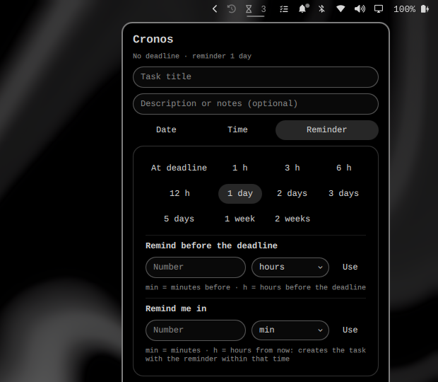

# Cronos

Bar widget and service for Omarchy with tasks and deadline reminders.



A quick access in the bar lets you add a task (title, optional note, due date
and time) and choose when to be reminded:

- **Day mode**: reminds you on the due day itself (e.g. "1 day before"), five
  minutes after each login and every five hours until you acknowledge it.
- **Exact mode**: reminds you at the exact configured time ("At deadline",
  "1 h", "3 h", "6 h", "12 h"), plus the custom fields "Remind before the
  deadline" (min/h) or "Remind me in" (min/h).
- If the machine was off when a reminder was due, it is notified five minutes
  after the next login.

It includes a completed-tasks section, loss-proof persistence (atomic writes
+ backup file) and automatic migration from the previous plugin version
(`angelherman.taskboard`).

## Installation

From the marketplace:

```
omarchy plugin install angelherman.cronos --enable
```

Or from the repository:

```
omarchy plugin add https://github.com/angelherman0130-cell/omarchy-cronos.git --enable
```

## Usage

1. Click the Cronos icon in the bar (or the urgent-task counter).
2. Type a title, an optional note, the due date/time and the reminder.
3. Press **＋ Add**.

Overdue, unacknowledged tasks are highlighted with the urgent color in the
bar. Completing a task moves it to "Completed"; the ✕ removes it.

State is stored in `~/.local/state/omarchy/cronos/tasks.json`
(plus `tasks.json.bak`).

## Development

```
omarchy plugin validate ~/.config/omarchy/plugins/angelherman.cronos
qmllint -I "$OMARCHY_PATH/shell" Panel.qml BarWidget.qml Service.qml TaskRow.qml
```

## License

[MIT](LICENSE) © Angel Herman